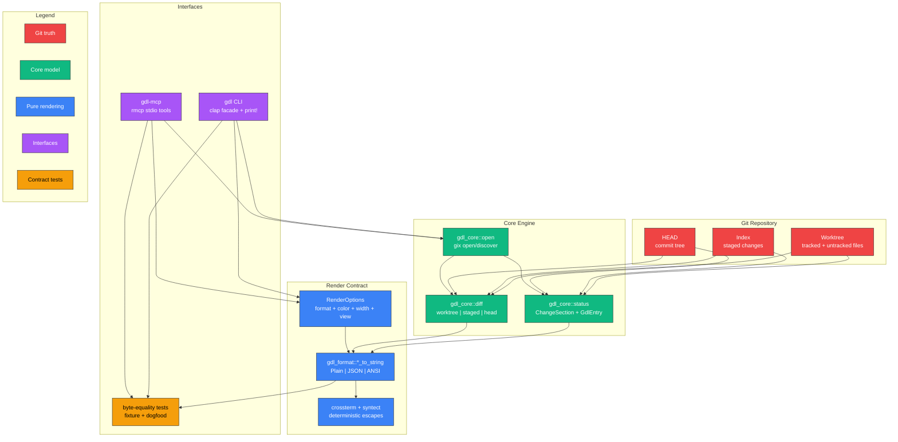

<div align="center">
  <h1>gdl</h1>
  <p><strong>VS Code Source Control status and diff rendering, rebuilt as a deterministic terminal CLI and MCP server.</strong></p>

  [](https://www.rust-lang.org/)
  [](LICENSE)
  [](crates/gdl-mcp)
  [](crates/gdl-cli)
  [](Cargo.toml)

  [](https://crates.io/crates/rmcp)
  [](https://crates.io/crates/gix)
  [](https://crates.io/crates/syntect)
  [](https://crates.io/crates/crossterm)
</div>

---

`gdl` is a read-only renderer for Git status and file diffs. It exposes the
same operation surface two ways:

- `gdl` CLI for terminal use
- `gdl-mcp` stdio server for agents

Both surfaces call the same pure `*_to_string` helpers with explicit
`RenderOptions`. No helper reads TTY state, `COLUMNS`, `NO_COLOR`, or ambient
process settings. The result is byte-stable output that can be asserted across
CLI and MCP.

```
You:    gdl --repo . --format ansi --color always status
gdl:    Staged (1)
        A  crates/gdl-mcp/tests/...

Agent:  tools/call gdl.status { "repo": ".", "format": "ansi", "color": "always" }
gdl:    -> byte-identical text payload
```

---

## Architecture



**Legend:** Red = Git truth, Green = core model, Blue = pure renderer,
Purple = interfaces, Yellow = byte-equality contract tests.

---

## Workspace layout

| Crate | Purpose |
|-------|---------|
| [`gdl-core`](crates/gdl-core) | gix-backed repository open/discover, status model, diff hunks |
| [`gdl-format`](crates/gdl-format) | pure status/diff renderers for plain text, JSON, and ANSI |
| [`gdl-cli`](crates/gdl-cli) | `gdl` binary; thin clap facade over core + format |
| [`gdl-mcp`](crates/gdl-mcp) | `gdl-mcp` binary; rmcp stdio server exposing `status`, `diff`, `version` |
| [`gdl-testkit`](crates/gdl-testkit) | dev-only real Git fixture builders shared by integration tests |

---

## Build

```sh
git clone https://github.com/npiesco/gdl
cd gdl
make release
# Binaries: target/release/gdl, target/release/gdl-mcp
```

The release target is a thin wrapper around `cargo build --release --workspace`.
The workspace sets `rust-version = "1.91"` and `-D warnings` through
`.cargo/config.toml`.

---

## CLI

Every CLI command requires an explicit repository path:

```sh
gdl --repo /path/to/repo status
gdl --repo /path/to/repo --format json status
gdl --repo /path/to/repo --format ansi --color always --width 120 status
gdl --repo /path/to/repo --paths-only status
```

Diffs are scoped by area:

```sh
gdl --repo /path/to/repo diff README.md --area worktree
gdl --repo /path/to/repo diff README.md --area staged
gdl --repo /path/to/repo diff README.md --area head
```

| Option | Values | Meaning |
|--------|--------|---------|
| `--format` | `ansi`, `plain`, `json` | output encoding |
| `--color` | `auto`, `always`, `never` | CLI color resolution; helpers receive explicit `Always`/`Never` |
| `--width` | integer | deterministic render width |
| `--paths-only` | flag | status-only path list view |
| `--area` | `worktree`, `staged`, `head` | diff baseline |

`gdl` with no subcommand defaults to `status`.

---

## MCP

Add the release binary to an MCP client config:

```json
{
  "mcpServers": {
    "gdl": {
      "command": "/path/to/gdl/target/release/gdl-mcp",
      "args": []
    }
  }
}
```

Or via Claude Code:

```sh
claude mcp add --scope user gdl /path/to/gdl/target/release/gdl-mcp
```

### Tools

| Tool | Description |
|------|-------------|
| `status` | render repository status with explicit `repo`, `format`, `color`, `width`, and `view` |
| `diff` | render one repository-relative file diff with explicit `repo`, `path`, `area`, `format`, `color`, and `width` |
| `version` | return the `gdl-core` package version |

MCP results are text content payloads. Error conditions are returned as MCP
tool errors with stable text, not process exits.

---

## Contract tests

`gdl` is built around tripwires rather than mocks:

- real temporary Git repositories
- real CLI binaries via Cargo integration-test binary discovery
- real `gdl-mcp` child processes over stdio JSON-RPC
- fixture and dogfood runs
- byte-for-byte CLI/MCP equality for status and diff
- dogfood race guards using `git status --porcelain=v2 -z` before and after

The important commands are:

```sh
cargo test --workspace
cargo fmt --all -- --check
cargo clippy --workspace --all-targets -- -D warnings
make release
```

---

## Non-goals

- no TUI, panes, alternate screen, or key handling
- no staging, committing, or other writes
- no remote operations
- no REPL
- no `log`, `blame`, or branch management

---

## License

`gdl` is licensed under the GNU Affero General Public License v3.0 only
(`AGPL-3.0-only`). See [`LICENSE`](LICENSE).
